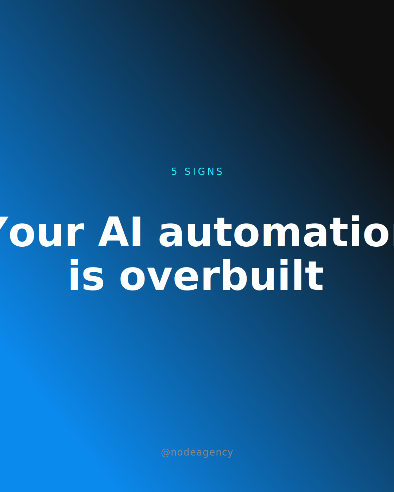
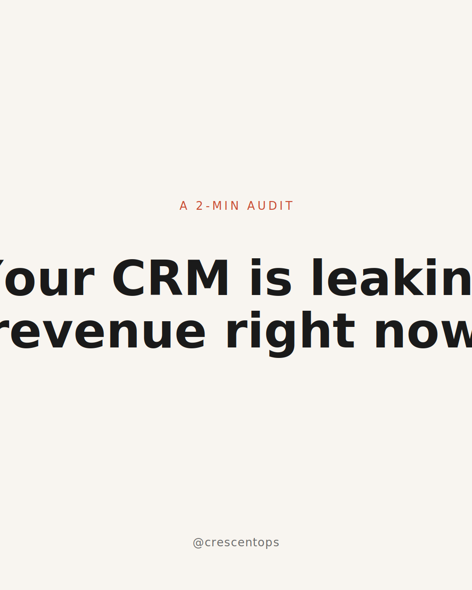
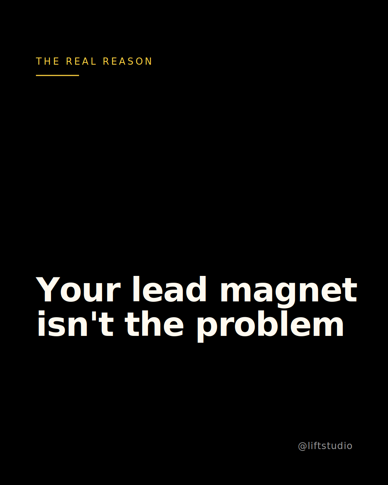

# node-carousel

**Free Instagram carousel generator for Claude Code. Procedurally varied, quality-locked, zero paid APIs.**

Turn a topic into a branded 5–8 slide SVG carousel in one command. Runs entirely on your Claude Code plan — no OpenRouter, no Gemini, no Canva, no subscriptions.

<p align="center">
  
  
  
</p>

---

## What makes v0.4 different

Most AI carousel tools are one of two things: dumb text templates that all look the same, or "AI generates the whole SVG" products that look gorgeous in the demo and break in week two.

This one is neither. v0.4 is a **procedural design system** — not a template engine, not a freeform generator.

- **Variety within quality.** Every carousel is seeded by `hash(brand.handle + topic + version)`. The same inputs always produce the byte-identical deck. Different inputs produce visibly different compositions — different typography scale, different decoration picks, different background variations — within a locked aesthetic. Two users generating two topics never get the same deck. Re-running on the same topic always does.
- **Token-driven polish.** Typography, spacing, grids, color roles, and decoration rhythm come from shared token files (not hardcoded per-slide). Change one token, every slide updates. Swap one preset, the whole deck re-skins without touching the content.
- **8 compositional patterns, 6 aesthetic presets.** Cover, list (bullet / numbered), stat-dominant, quote-pulled, split-comparison, CTA — each pattern has multiple typographic + background variations. Presets pick from well-known brand languages (Stripe / Linear, NYT, Pentagram, Vercel, Fontshare).
- **Deterministic seeded sampling across 6 variation axes.** Size (compact / standard / oversized), weight contrast, kicker presence, decoration flavor, background variant, noise texture — each is a controlled axis. The seeded RNG picks a coordinate in that space. Output feels hand-designed but is reproducible and version-controllable.

## What's new in v0.6 — Brand Scan Deep

`/node-carousel:scan` got a major upgrade. v0.5 shipped a single-page scan with basic CSS extraction; v0.6 makes it actually reliable on real sites.

- **Multi-page crawl.** Home page + up to 2 discovered subpages (prioritizes `/about`, `/pricing`, `/team`, `/work`). Font + color signals are merged across pages — one-off hero overrides don't skew the profile anymore.
- **Logo extraction.** Four-stage fallback chain: inline `<svg>` in header → `` logo → `<link rel="icon">` favicon → apple-touch-icon. Writes `scan-logo.svg` (or `.png`) into the output dir and auto-populates `visual.logo.file`.
- **Claude-vision screenshot analysis.** Feeds the home screenshot to Claude with a structured prompt that reads visual hierarchy, whitespace discipline, mood, and imagery style. The synthesizer uses these signals to pick the closest preset — no more "all Framer sites get editorial-serif."
- **Voice + niche classification.** Pulls real page copy (hero, body, CTAs) and asks Claude for a tone description + industry vertical. Goes straight into `brand.tone` and feeds later strategy prompts.
- **ΔE color clustering.** Perceptual color distance (CIE76) collapses near-duplicates — `#0A0A0A` and `#0B0B0B` stop both showing up as "distinct brand colors." Output is 3–6 genuinely different colors, not 20+ CSS variables.
- **Recalibrated confidence.** No more fake `1.0`. Real sites land `0.85–0.95`; thin or JS-heavy sites land `0.4–0.7` and honestly say so. The `/scan` command falls back to the manual wizard when confidence is low.
- **Opt-in BrandFetch augmentation.** Free-tier API key (100 req/mo) sharpens logo + color data for well-known brands. Strictly optional — set `BRANDFETCH_API_KEY` or run fully self-hosted (see below).

## Install

```bash
git clone https://github.com/nodeagencyai/node-carousel ~/.claude/plugins/node-carousel
```

Restart Claude Code. `/node-carousel:setup` should appear in the command palette.

## Quick start

```bash
# 1a. Auto-detect brand from your website (NEW in v0.5 — fastest path)
/node-carousel:scan https://yourbrand.com
#    Or bring reference carousels for style matching:
/node-carousel:scan https://yourbrand.com --references ./my-carousels/

# 1b. OR configure brand manually via wizard
/node-carousel:setup

# 2. Generate a carousel
/node-carousel:generate 5 signs your AI automation is over-engineered

# 3. Export PNGs (optional — requires Puppeteer, bundled)
/node-carousel:export
```

**v0.5 adds `/node-carousel:scan`** — point it at your site, it takes a Playwright screenshot, extracts fonts + colors from CSS, optionally reads 3–5 of your existing carousel images via Claude's native vision, then synthesizes a `brand-profile.json` that matches your existing visual language. Picks the closest of 6 aesthetic presets with weighted confidence scoring; falls back to the manual wizard if the scan is low-confidence.

For a plain-English guide to scan confidence scores, see [`docs/confidence-guide.md`](docs/confidence-guide.md).

### Optional: BrandFetch API key (free tier = 100 requests/month)

For sharper brand data on well-known brands, set your BrandFetch API key before running `/node-carousel:scan`:

```bash
export BRANDFETCH_API_KEY=your_key_here
```

Get a free key at [brandfetch.com/developers](https://brandfetch.com/developers). When set, scans augment self-hosted extraction with BrandFetch's curated logos, colors, and metadata. When not set, everything runs zero-API as before — BrandFetch is strictly an optional accuracy booster, never a blocker.

Outputs land in `./output/<topic-slug>/`:

- `slide-01.svg` … `slide-NN.svg` — the slides
- `preview.html` — all slides in a single browser view
- `caption.txt` — Instagram caption
- `strategy.json` — slide spec (edit + re-render without re-asking Claude)
- `_axes.json` — the chosen coordinate on the 6 variation axes (for debugging + reproducibility)

## Configuration

Your `brand-profile.json` lives at the project root. Setup writes it for you; you can hand-edit any field.

Full schema with every field, type, and default: [**`docs/brand-profile-schema.md`**](docs/brand-profile-schema.md).

Fonts are sourced from **Google Fonts** (any free family name works) and **Fontshare** (for the `satoshi-tech` preset). Backgrounds, noise, decorations, logos, numbering, and dimensions are all declarative — no CSS, no code.

## The 6 aesthetic presets

Choose one during setup. Each preset is a coherent brand language — fonts, palette, background style, decoration defaults — not a theme skin.

| Preset | Voice fit | Visual language |
|---|---|---|
| `editorial-serif` | Warm, premium, long-form | Instrument Serif + Inter, paper-warm palette, soft grain (Lenny's Newsletter, Morning Brew) |
| `neo-grotesk` | Clean, confident, SaaS | Inter + Inter, flat neutrals + single strong accent (Stripe, Linear, Cal.com) |
| `technical-mono` | Precise, developer-facing | JetBrains Mono display + Inter body, bracketed corners, grid overlay (Vercel v0, Supabase) |
| `display-serif-bold` | High-contrast editorial | DM Serif Display + Manrope, NYT-style oversized headlines with drop rules |
| `utilitarian-bold` | Swiss minimal, stark | Archivo Black + Inter, left-aligned, heavy black-on-white (Pentagram, Manual) |
| `satoshi-tech` | Modern, tech-forward | Satoshi (Fontshare) + Inter, dark noise gradient + lime accent, premium web3 / AI startup feel |

## The 8 patterns

Claude picks the pattern per slide based on content shape — not a random lottery.

| Pattern | When to use |
|---|---|
| `cover-asymmetric` | Opening slide. Kicker + 2-line headline anchored top-left, handle bottom. Editorial default. |
| `cover-centered` | Opening slide, centered variant. Works better for short punchy hooks. |
| `list-bullet` | 3–5 parallel points. Arrow or icon prefix. |
| `list-numbered` | Ordered / sequential list. Large accent numerals. |
| `stat-dominant` | One number that has to land. 250px+ stat + label + context row. |
| `quote-pulled` | A line that earns isolation. 2–4 line quote + attribution. |
| `split-comparison` | Before / after, good / bad, them / us. Two columns, shared midline. |
| `cta-stacked` | Closing ask. Hook + button + subtext + handle. |

## Background + texture vocabulary

9 background types, any of which can be layered with 1 of 6 noise textures.

**Backgrounds:** `solid` · `gradient` · `mesh` (blurred color blobs) · `radial` · `image` · `dot-grid` · `geometric-shapes` · `glow-sphere` · `noise-gradient`

**Noise textures:** `film` (classic grain) · `static` (coarse TV) · `organic` (soft cloudy) · `grit` (tight digital) · `ink-wash` (blurred painterly) · `dither` (1-bit pixelation)

Each noise type is a different `feTurbulence` configuration tuned by hand. Set `noise.intensity` (0–0.2) for the overall opacity, `noise.scale` to tighten or loosen the grain.

## Decorations

5 optional decorative layers you can toggle per brand or override per slide:

- `cornerMarks` — L-brackets at each corner (technical / utilitarian aesthetic)
- `accentRule` — short horizontal emphasis line under the kicker (editorial)
- `numberBadges` — oversized low-opacity slide number as watermark (for numbered decks)
- `pullQuoteBlock` — colored rect behind a highlighted phrase
- `oversizedMark` — huge decorative punctuation as visual anchor (serif brands)

## Icons

Three sources, one mental model (all 24×24, stroke-based, currentColor — ready for recoloring via brand accent):

- **Lucide library** (30 curated icons bundled) — `icon: { library: "bolt" }`. Shield, bolt, rocket, chart-bar, target, clock, dollar, trending-up, check, arrow-right, plus 20 more.
- **User file upload** — `icon: { file: "path/to/icon.svg" }`. Drop your own 24×24 SVG (stroke="currentColor"). Relative paths resolve from `strategy.json`.
- **AI-generated inline** — when no library or file is specified, Claude generates an SVG on the fly, validated against safe-bounds (≤ 8KB, no `<script>`, no hardcoded colors, inside viewBox).

Logos work the same way: `brand.visual.logo = { file: "logo.svg", position: "top-left", size: 48 }` ships the logo on cover + CTA slides (body slides intentionally skip it to avoid visual competition with content).

## How determinism + variety work

```
seed = hash(brand.handle + topic + carouselVersion)
rng  = seededRandom(seed)

axes = {
  size:         rng.pick([compact, standard, oversized]),
  weightRatio:  rng.pick([balanced, high-contrast, ultra-bold]),
  kicker:       rng.pick([always, hero-only, none]),
  decoration:   rng.pick([minimal, editorial, technical]),
  bgVariant:    rng.pick([primary, alt-angle, alt-palette]),
  noiseTexture: rng.pick([film, organic, grit, ink-wash, dither, static]),
}
```

Same brand + same topic + same version → identical coordinate → identical deck (shareable, committable). Different topic → different coordinate → visibly different composition, same brand system. Different brand → different palette + preset on top of the coordinate. No two users get the same deck; any single user gets the same deck twice if they want to.

The `_axes.json` file in every output folder logs the chosen coordinate so you can debug, reproduce, or force a different axis by seeding a different carousel version.

## FAQ

**Does it work without paid APIs?**
Yes. Zero third-party keys. The whole pipeline runs on your Claude Code plan — strategy copy from Claude, SVG render from local Node scripts, PNG export via bundled Playwright. No Gemini, no Stability, no Replicate, no Canva, no Figma.

**Can I use my own fonts?**
Yes. Any [Google Fonts](https://fonts.google.com) family works — put the name in `visual.fonts.display` / `visual.fonts.body`. The `satoshi-tech` preset uses [Fontshare](https://fontshare.com) (also free). Fonts load via `@import` inside the SVG so they render correctly in both browser preview and PNG export. Custom self-hosted fonts aren't supported yet; fork and embed base64 in the templates if you need that.

**Can I add custom templates / patterns?**
Yes. Drop a new SVG in `patterns/` using the `{{PLACEHOLDER}}` token pattern, register it in `patterns/manifest.json`, and add strategy guidance in `prompts/strategy-system.md`. Walkthrough: [`docs/adding-templates.md`](docs/adding-templates.md).

**Can I upload my own icons and logo?**
Yes. Icons: `icon: { file: "./path/to/my-icon.svg" }` on any slide. Logo: `brand.visual.logo.file = "./logo.svg"` at the brand level. Both must be 24×24 viewBox SVGs using `stroke="currentColor"` (Lucide convention). They pass the same safe-bounds validation as AI-generated icons.

**Does it work on Haiku / Sonnet / Opus?**
Yes. Strategy + content generation is well within Haiku's reach. Opus produces slightly tighter copy. The render pipeline is deterministic Node — no LLM cost there.

**Is the output actually editable?**
Yes. Every slide is standalone SVG — open in Figma / Illustrator / text editor and hand-tune. `strategy.json` is also editable — change a line, re-run `node scripts/render-v0.4.mjs <paths>` without calling Claude again.

## What's planned (v0.7+)

- **AI-generated background images** via Gemini (optional, falls back to procedural when no API key)
- **Bundled grunge texture PNGs** for heavier analog-print aesthetics (newsprint, mimeograph, risograph)
- **Tables + bar-chart patterns** for data-heavy topics
- **Broader icon library** — expand from 30 to 100+ Lucide icons + sector-specific sets (fintech, healthcare, devtools)

## License

[MIT](LICENSE).

## Credits

Built by [Niek Huggers](https://nodeagency.ai) at Node. If this saved you from paying $25/mo for Canva, DM [@nodeagency](https://instagram.com/nodeagency) and let me know.
